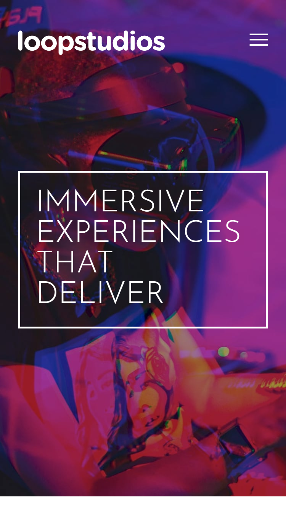
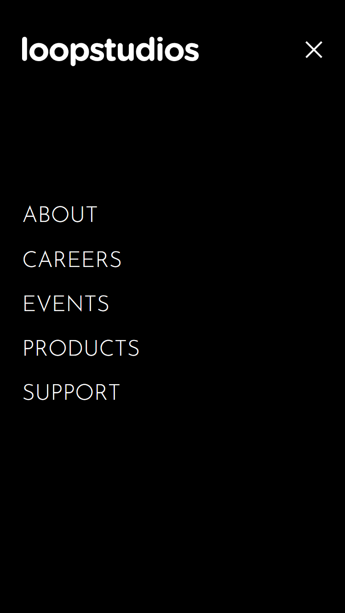
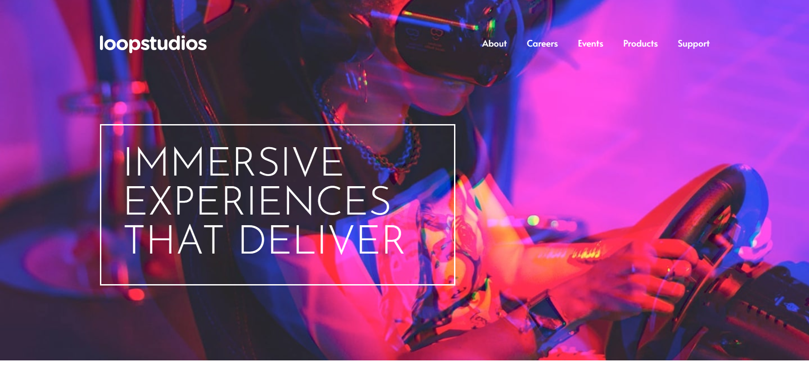

# Frontend Mentor - Loopstudios landing page solution

This is a solution to the [Loopstudios landing page challenge on Frontend Mentor](https://www.frontendmentor.io/challenges/loopstudios-landing-page-N88J5Onjw). Frontend Mentor challenges help you improve your coding skills by building realistic projects. 

## Table of contents

- [Overview](#overview)
  - [The challenge](#the-challenge)
  - [Screenshot](#screenshot)
  - [Links](#links)
- [My process](#my-process)
  - [Built with](#built-with)
  - [What I learned](#what-i-learned)
  - [Continued development](#continued-development)
- [Author](#author)

**Note: Delete this note and update the table of contents based on what sections you keep.**

## Overview

### The challenge

Users should be able to:

- View the optimal layout for the site depending on their device's screen size
- See hover states for all interactive elements on the page

### Screenshot


1. Mobile View


2. Menu Mobile View


3. Menu Mobile View



### Links

- Solution URL: [https://github.com/sezaru-dev/loopstudios-landing-page](https://github.com/sezaru-dev/loopstudios-landing-page)
- Live Site URL: [https://loopstudios-cb.netlify.app/](https://loopstudios-cb.netlify.app/)

## My process

### Built with

- HTML5
- CSS
- Mobile-first workflow
- [React](https://reactjs.org/) - JS library
- [Vite.js](https://vitejs.dev/) - JS Development Tool
- [TailwindCSS](https://tailwindcss.com/) - CSS Framework


### What I learned

Use this section to recap over some of your major learnings while working through this project. Writing these out and providing code samples of areas you want to highlight is a great way to reinforce your own knowledge.

To see how you can add code snippets, see below:

1. ::after selector in Tailwindcss
```css
   li a{
      @apply after:content-[''] after:block after:mx-auto after:mt-[.14rem] after:h-[.14rem] after:w-0 after:bg-wht after:transition-all after:ease-in-out after:duration-300  hover:after:w-full
   }
```
2. Display different image with same image but different sizes on different screens using `<picture>` tag with `<source/>` tag
```html
<picture>
   {
      card.srcSetMedia.map(srcset => (
         <source srcset={srcset.src} media={srcset.media} />
      ))
   }
   
</picture>
```

### Continued development

Use this section to outline areas that you want to continue focusing on in future projects. These could be concepts you're still not completely comfortable with or techniques you found useful that you want to refine and perfect.

- Become more comfortable with React
- Become comfortable and fast in executing design to code

## Author

Frontend Mentor - [sezaru-dev](https://www.frontendmentor.io/profile/sezaru-dev)

